# Circle App
> This is a mobile digital well-being app which aims to help people manage the time on phone better.


## Architecture
This app is mainly implemented by React Native and Amplify Framework on AWS.

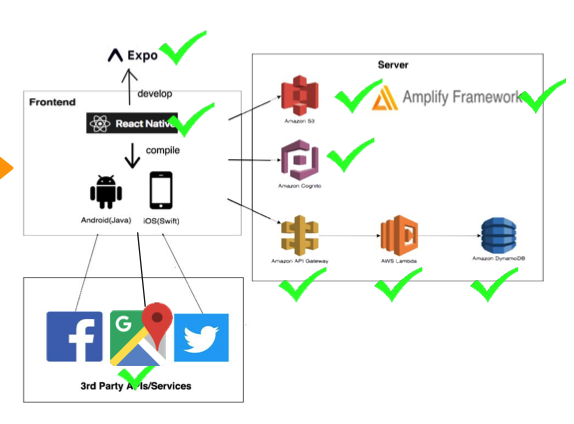

## Installation and Development


### Prerequisite:

- npm
- expo

### Installation

Clone the repository to you local or download the repository.

In the root directory, run the command to download the dependencies.

```sh
npm install
```

Then use expo to run the app.

```sh
expo start
```
After that, you can run the app through simulator or open your expo app on your phone to see the app.

## Usage example

### Resgister and Login

At first, the user needs to register for an account and log in to the app.

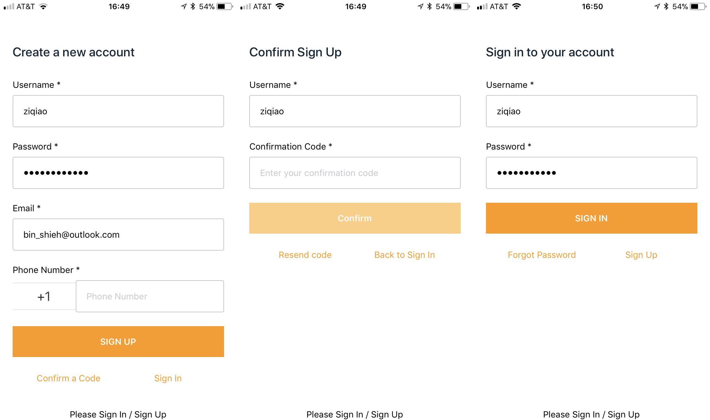

### Onboarding

Then the user will go through the onboarding to screen to learn more about the app.

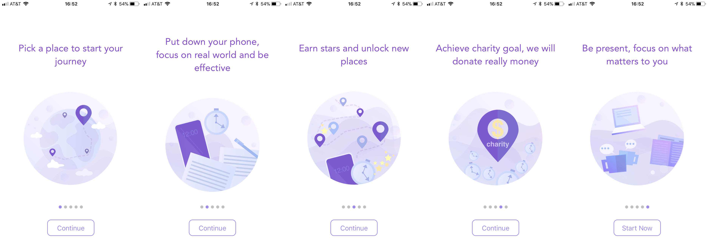

### Set timer and Succeed & Fail

After onboarding, the user can truly use our app now. For our app, we mainly refer to the forest app and add a travel gamification into our app. The user can choose a city and set a timer to keep away from the phone and focus on study, work, outdoor activities and so on. 

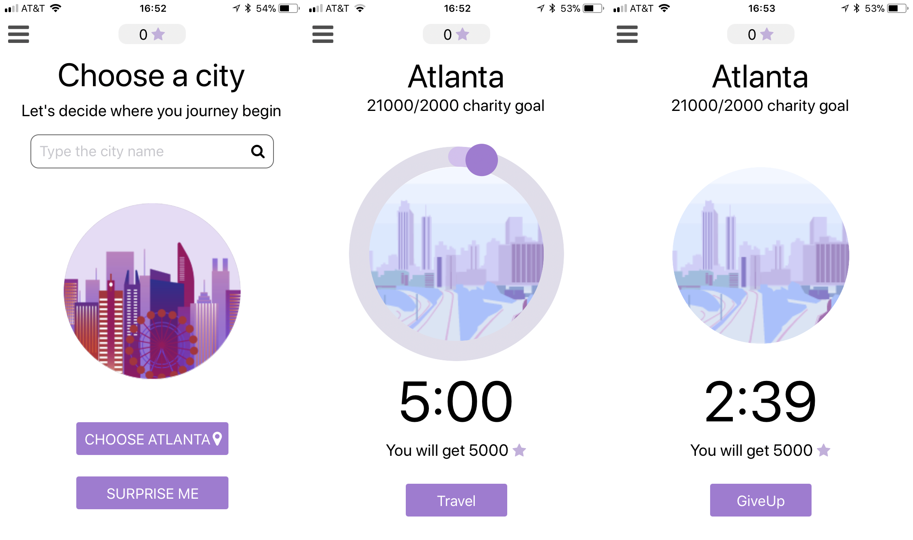

Once the user finishes the timer, he can get stars and some surprising rewards, and share this accomplishment to his friends.

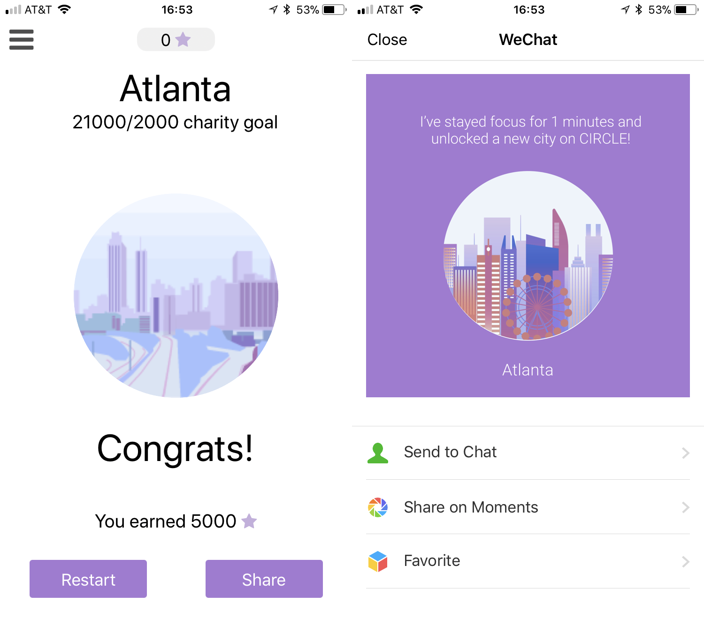

Also, the users can stop a timer by themselves or fail if they make the app on background for more than a configured time, which will get no stars.


### Unlock New City

Once the user has enough stars, the system will recommend cities which the user can afford stars to unlock. The user can use map to have a detailed look. Then the user can unlock and travel to new cities to get different rewards. Also, the user can revisit the visited cities.

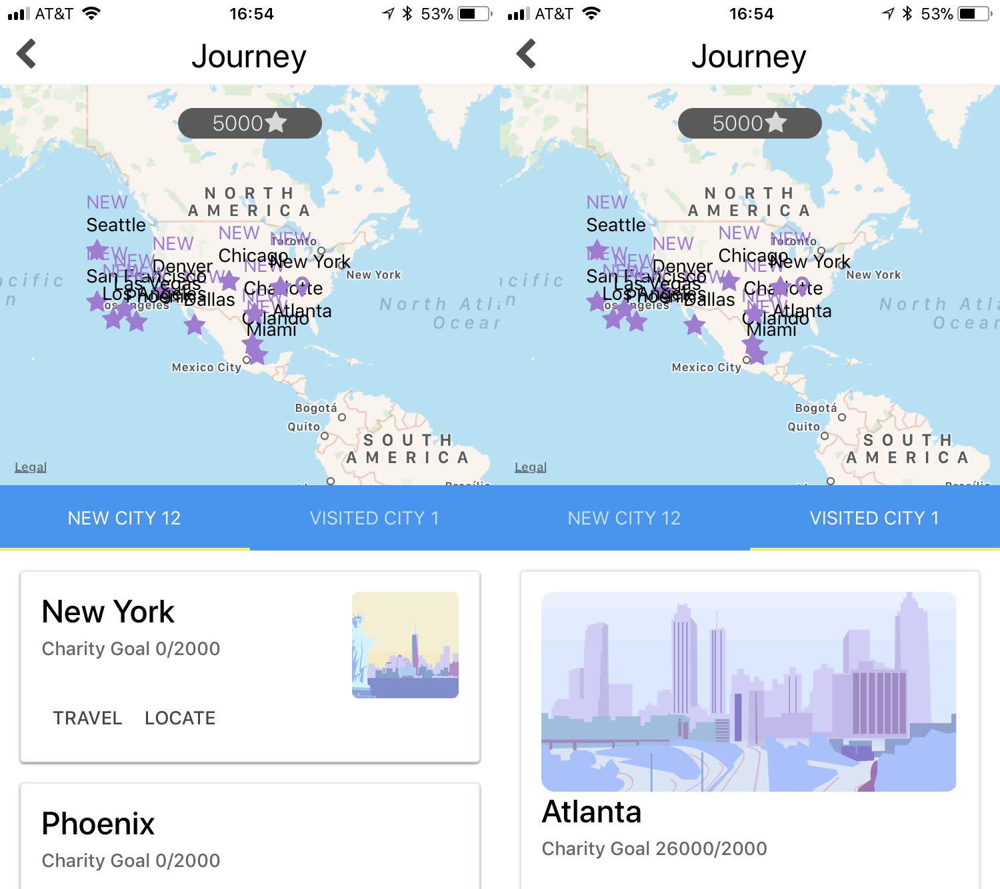

### Statistic Report

For user to anlyze their behaviors better, we will give user statistic reports on different time periods. Also, the user can get their basic info on the account page.

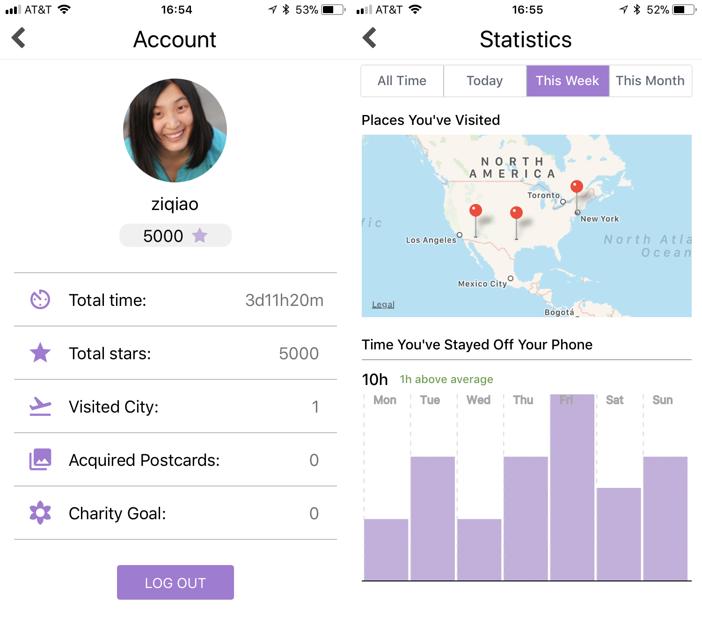

### Friends

To motivate user to use our app, we add the friend features. The user can add his/her friends and compete with each other.

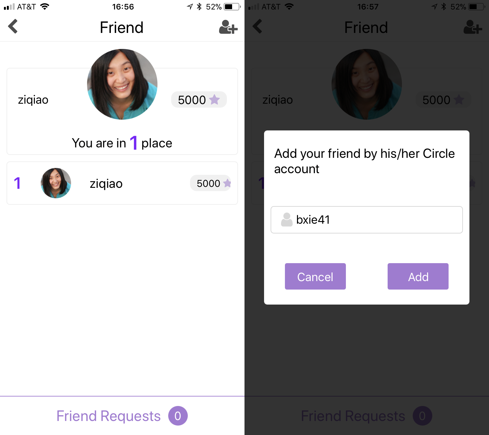

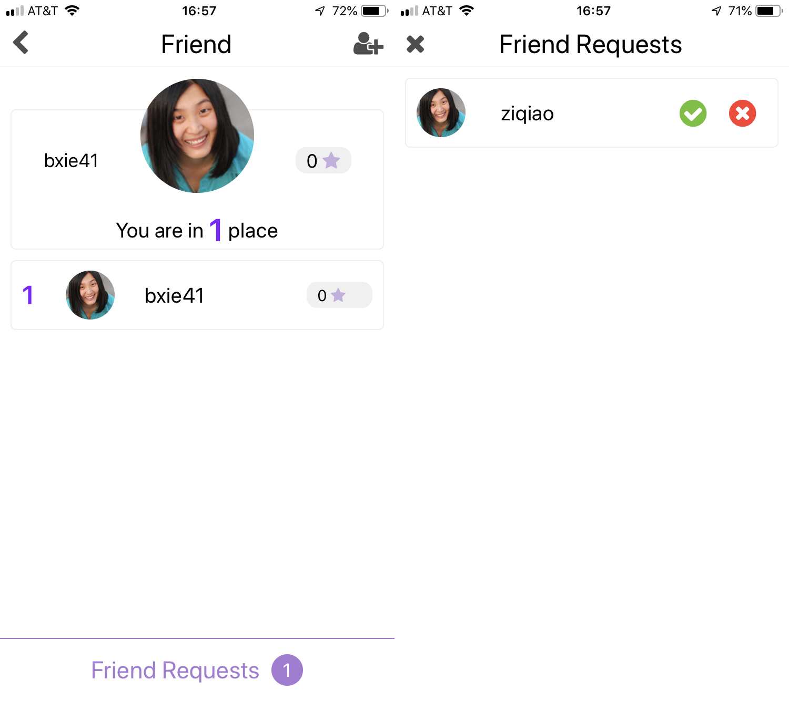

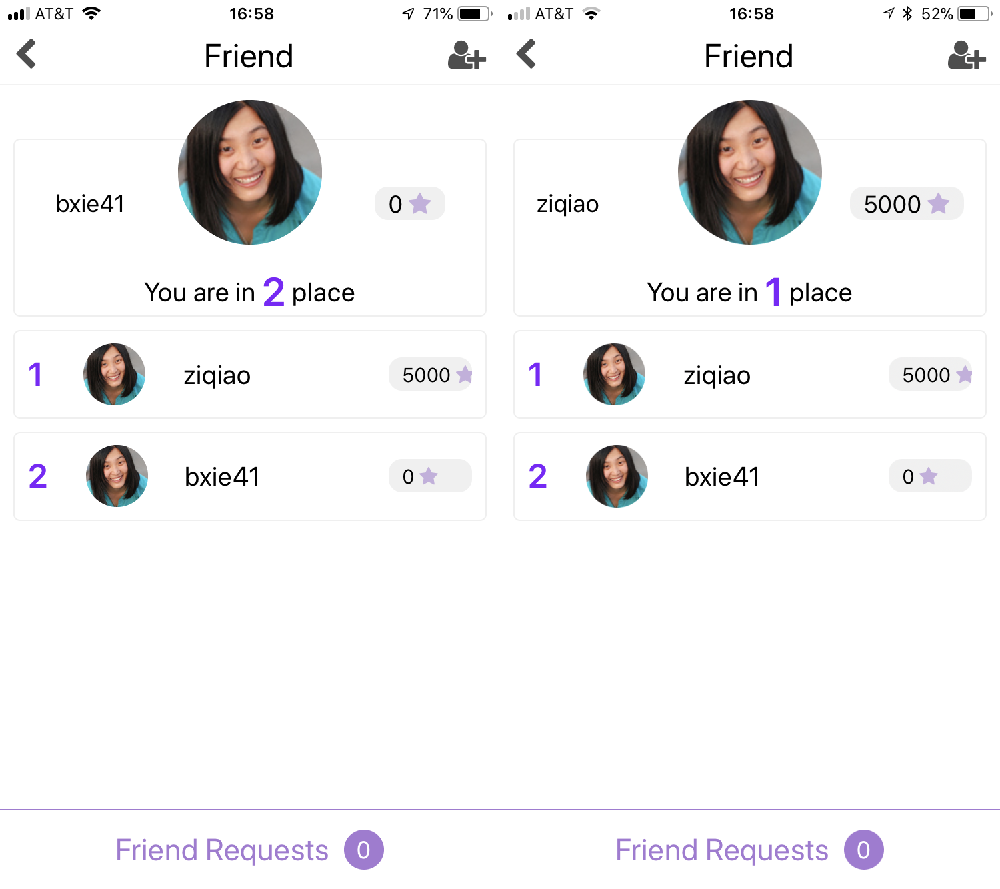

### Achivement & Charity Goal

In our app, we have said the users can get surprising rewards. For short term reward, the users can get beautiful postcards of different cities once the users achieve a small goal, like getting 100 stars totally. For long term goal, each city has a charity goal. All the users traveling on the same city contribute their time to the city and once reaching the city charity goal, we will ask the cooperating organizations and sponsor companies to donate money to some local environment protection organizations or hospital. (An idea now.)

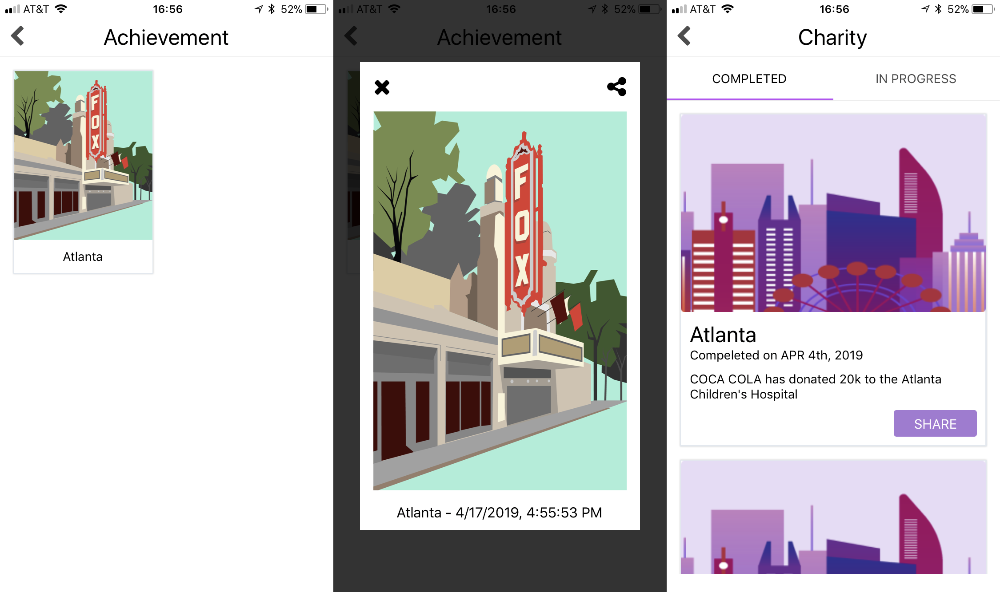

## Meta
### Development: 
- Bin Xie - bin.xie@gatech.edu
- Anjian Peng - penganjian@gatech.edu

### UI Design:
- Xiuxiu Yuan - xyuan40@gatech.edu
- Xuejin Tan - tanxjs@gatech.edu

## Acknowledge
- react-native-elements
- react-native-tab-view
- react-native-svg-charts
- react-native-vector-icons
- react-navigation
